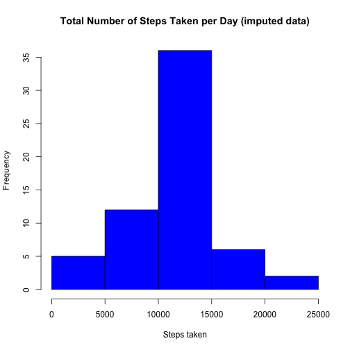

***  
  
#### This analysis explores data about personal movement using activity monitoring devices such as a Fitbit, Nike Fuelband, or Jawbone Up.  
  
##### The variables included in this dataset are:

##### steps: Number of steps taking in a 5-minute interval (missing values are coded as NA)  
##### date: The date on which the measurement was taken in YYYY-MM-DD format  
##### interval: Identifier for the 5-minute interval in which measurement was taken  
  

#### The R scripts and correpsonding output below will: 1. load and preprocess data, 2. calculate the average number of steps taken per day, 3. examine the average daily activity pattern, 4. impute missing data, and 5. determine if there are activity pattern differences on weekdays versus weekend days.  
  
***  
##### 1. Loading and preprocessing the data

```r
# a. Load packages
library(dplyr,warn.conflicts = FALSE, quietly=TRUE)

# b. Set working directory where you want to store the unzipped datafiles
setwd(wd)

# c. Unzip and Extract data from url
temp <- tempfile()
filename <- "https://d396qusza40orc.cloudfront.net/repdata%2Fdata%2Factivity.zip"
download.file(filename, temp, mode = "wb")
unzip(temp)
df <- tbl_df(read.csv("./activity.csv"))

## set date to as.Date()
df <- df %>%
  transform(date = as.Date(date))
```
***  
##### 2. What is mean total number of steps taken per day?

```r
# a. Calculate the total number of steps taken per day
df_1 <- df %>%
  group_by(date) %>% 
  summarise(sum_steps = sum(steps,na.rm = TRUE))
  
# b. Make a histogram of the total number of steps taken each day
with(df_1,hist(sum_steps,
               main="Total Number of Steps Taken per Day",
               col="red",
               xlab="Steps taken"))
```


```r
# c. Calculate and report the mean and median of the total number of steps taken per day
mean(df_1$sum_steps) # mean steps
```

```
## [1] 9354.23
```

```r
median(df_1$sum_steps) # median steps
```

```
## [1] 10395
```
***  
##### 3. What is the average daily activity pattern?

```r
# a. Make a time series plot (i.e. type = "l") of the 5-minute interval (x-axis) 
# and the average number of steps taken, averaged across all days (y-axis)

## aggregate step data at interval 
df_2 <- df %>%
  group_by(interval) %>%
  summarise(mean_steps = mean(steps,na.rm = TRUE))

## time series plot 
with(df_2,plot(interval,mean_steps, type = "l", 
               xlab = "5 Minute Interval", ylab = "Mean Steps",
               main = "Average Number of Steps Taken"))
```


```r
# b. Which 5-minute interval, on average across all the days in the dataset, contains the maximum number of steps?
df_2[which.max(df_2$mean_steps),]$interval
```

```
## [1] 835
```
***  
##### 4. Imputing missing values

```r
# a. Calculate and report the total number of missing values in the dataset (i.e. the total number of rows with)
length(df[is.na(df$steps),]$steps)
```

```
## [1] 2304
```

```r
# b. For missing data, replace with the calculated mean of the 5-minute interval
# and create a new dataset that is equal to the original dataset but with the missing data filled in.
df_3 <- df %>%
  group_by (interval) %>%
  mutate(steps = ifelse(is.na(steps),mean(steps, na.rm = TRUE), steps))

# c. Create a new dataset that summarizes the number of steps take by day
df_4 <- df_3 %>%
  group_by(date) %>% 
  summarise(sum_steps = sum(steps,na.rm = TRUE))

# d. Plot a histogram of the number of steps by day
with(df_4,hist(sum_steps,
               main="Total Number of Steps Taken per Day (imputed data)",
               col = "blue",
               xlab="Steps taken"))
```



```r
# e. Report the mean and median of imputed mean data
mean(df_4$sum_steps) # mean steps
```

```
## [1] 10766.19
```

```r
median(df_4$sum_steps) # median steps
```

```
## [1] 10766.19
```

```r
# g. Do these values differ from the estimates from the first part of the assignment? 
mean(df_1$sum_steps) - mean(df_4$sum_steps) # difference between mean steps of imputed data and original data 
```

```
## [1] -1411.959
```

```r
median(df_1$sum_steps) - median(df_4$sum_steps) # difference between median steps of imputed data and original data 
```

```
## [1] -371.1887
```

```r
print("The impact of imputing missing data increases the mean and median estimates")
```

```
## [1] "The impact of imputing missing data increases the mean and median estimates"
```
***  
##### 5. Are there differences in activity patterns between weekdays and weekends?

```r
#      a. For this part the weekdays() function may be of some help here. Use the dataset with the 
#      filled-in missing values for this part.
#      b. Create a new factor variable in the dataset with two levels – “weekday” and “weekend” indicating 
#      whether a given date is a weekday or weekend day.
df_5 <- df_3 %>%
  transform(day_type = ifelse(weekdays(date) %in% c("Saturday","Sunday"),"weekend","weekday")) %>%
  group_by(day_type,interval) %>%
  summarise(mean_steps = mean(steps))
#      c. Make a panel plot containing a time series plot (i.e. type = "l") of the 5-minute interval (x-axis)
#      and the average number of steps taken, averaged across all weekday days or weekend days (y-axis). 

par(mfcol=c(1,2))
with(df_5[which(df_5$day_type=='weekday'),], plot(interval,mean_steps, type = "l", 
                                                  xlab = "5 Minute Interval", ylab = "Mean Steps",
                                                  main = 'Average Number of Steps Taken on \n Weekdays by Time Interval',
                                                  cex.main=0.75))

with(df_5[which(df_5$day_type=='weekend'),], plot(interval,mean_steps, type = "l", 
                                                  xlab = "5 Minute Interval", ylab = "Mean Steps",
                                                  main = 'Average Number of Steps Taken on \n Weekends by Time Interval',
                                                  cex.main=0.75))
```


